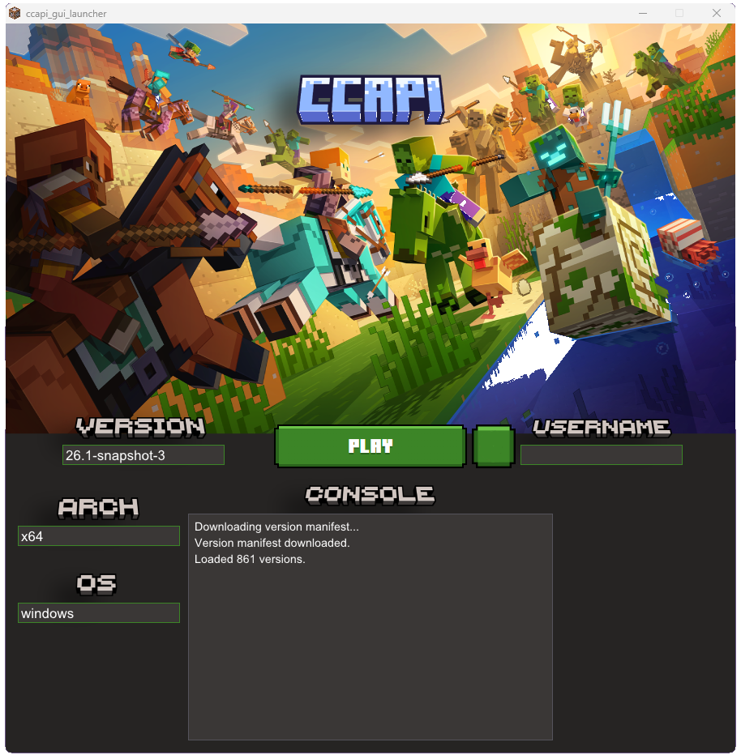

<p align="center"></p>

# ccapi
An API for downloading minecraft assets & launcher.

This API is in WIP state.

The goal of this project is to create an easy-use API for downloading all sorts of assets from mojangs servers, and to create a lightweight launcher that can be used anywhere.

## Features
- API
    - Version json downloading.
    - Client jar downloading.
    - Assets downloading.
    - Server jar downloading.
    - Libraries downloading.
    - Natives extracting.
    - Starting a offline Minecraft process.
    - Jdk downloading.
    - Full cross-platform support (windows, macos and linux)
    - A gui application using this API
## Planned
- Fabric support.
- Server process starting.
- Official Microsoft account authentication with mojang servers.

## Building
## cli
### Windows
1. Download the latest version of [MSYS2](https://www.msys2.org/). After installation open the MINGW64 shell.
2. Install the following dependencies:
    ```sh
    pacman -S mingw-w64-x86_64-libarchive
    pacman -S mingw-w64-x86_64-nlohmann-json
    pacman -S mingw-w64-x86_64-cmake
    ```
3. Clone this repository:
   ```sh
   git clone --recurse-submodules https://github.com/cornedev/ccapi.git
   cd ccapi/cli
   ```
4. Build the application:
   ```sh
   cmake -S . -B build
   ```
   and then:
   ```sh
   cmake --build build
   ```
That's it. The executable will be in `/build/` and all dependencies will be automatically copied from `/runtime/bin/`

### Linux
1. Get the following dependencies on your system:
   - [nlohmann/json](https://github.com/nlohmann/json)
   - [libarchive](https://github.com/libarchive/libarchive)

2. Clone this repository:
   ```sh
   git clone --recurse-submodules https://github.com/cornedev/ccapi.git
   cd ccapi/cli
   ```
3. Build the application:
   ```sh
   cmake -S . -B build
   ```
   and then:
   ```sh
   cmake --build build
   ```
That's it. The executable will be in `/build/` and you can run it with:
   ```sh
   ./build/ccapi_cli
   ```

## gui
### Windows
1. Download the latest version of [MSYS2](https://www.msys2.org/). After installation open the MINGW64 shell.
2. Install the following dependencies:
    ```sh
    pacman -S mingw-w64-x86_64-libarchive
    pacman -S mingw-w64-x86_64-nlohmann-json
    pacman -S mingw-w64-x86_64-glfw
    pacman -S mingw-w64-x86_64-cmake
    ```
3. Clone this repository:
   ```sh
   git clone --recurse-submodules https://github.com/cornedev/ccapi.git
   cd ccapi/gui
   ```
4. Build the application:
   ```sh
   cmake -S . -B build
   ```
   and then:
   ```sh
   cmake --build build
   ```
That's it. The executable will be in `/build/` and all dependencies will be automatically copied from `/runtime/bin/`

### Linux
1. Get the following dependencies on your system:
   - [nlohmann/json](https://github.com/nlohmann/json)
   - [libarchive](https://github.com/libarchive/libarchive)
   - [glfw](https://github.com/glfw/glfw)
   - [curl](https://github.com/curl/curl)
   - [cmake](https://github.com/Kitware/CMake)

2. Clone this repository:
   ```sh
   git clone --recurse-submodules https://github.com/cornedev/ccapi.git
   cd ccapi/gui
   ```
3. Build the application:
   ```sh
   cmake -S . -B build
   ```
   and then:
   ```sh
   cmake --build build
   ```
That's it. The executable will be in `/build/` and you can run it with:
   ```sh
   ./build/ccapi_gui
   ```

<br>

If you ever want to clean or rebuild (for both applications):
   ```sh
   rm -rf build
   ```
   And run the build commands again.

## Showcase
### cli launcher

### gui launcher


## License
All the code is licensed under the [MIT license](LICENSE).
